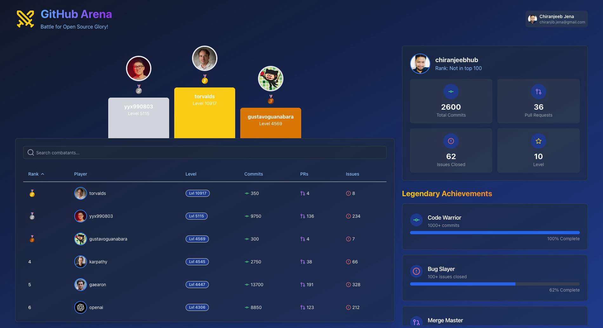

# 🏆 GitHub Gaming Arena

## 📖 Description

GitHub Gaming Arena is an interactive web application that gamifies GitHub activity. It creates a competitive environment where users can see their GitHub stats presented as gaming achievements and compare their performance with other users.



## ✨ Features

- 🔐 **User Authentication**: Integrated with Clerk for secure user sign-in.
- 🏅 **Leaderboard**: Displays top GitHub users with their ranks and stats.
- 👤 **User Profiles**: Shows detailed GitHub statistics for authenticated users.
- 🎖️ **Achievements**: Gamified representation of GitHub activity with progress tracking.
- 📱 **Responsive Design**: Adapts to different screen sizes for optimal viewing experience.
- 🎭 **Animations**: Utilizes Framer Motion for smooth, engaging animations.

## 🛠️ Technologies Used

- ⚛️ React
- 🔼 Next.js
- 🔒 Clerk (for authentication)
- 🎬 Framer Motion (for animations)
- 🎨 Tailwind CSS (for styling)
- 🔣 Lucide React (for icons)
- 🌐 Axios (for API requests)
- 🎉 Canvas Confetti (for celebratory effects)

## 🧩 Key Components

1. 🎮 **GitHubGamingArena**: The main component that orchestrates the entire application.
2. 📊 **LeaderboardContent**: Displays the leaderboard with search and sort functionality.
3. 📈 **ProfileContent**: Shows the authenticated user's GitHub stats and achievements.
4. 🥇 **OlympicPodium**: A visual representation of the top 3 users.
5. 🏆 **AchievementCard**: Displays individual achievements with progress bars.

## 🔄 How It Works

1. The application fetches top GitHub users and their stats from a custom API.
2. For authenticated users, it retrieves their personal GitHub data.
3. Users are ranked based on their GitHub activity (commits, PRs, issues, etc.).
4. The leaderboard can be searched and sorted by different criteria.
5. User profiles display personalized stats and achievement progress.
6. Animations and confetti effects enhance the user experience.

## 🚀 Installation

1. Clone this repository:

   ```bash
   git clone https://github.com/your-username/ImageWizard.git
   ```

2. Navigate to the project directory:

   ```bash
   cd ImageWizard
   ```

3. Install the dependencies:
   ```bash
   npm install
   ```

## 🛠️ Usage

1. Run the app locally:

   ```bash
   npm run dev
   ```

2. Open the app in your browser at http://localhost:3000.

## 🤝 Contributing

1. Fork the repository.
2. Create your feature branch: `git checkout -b feature/YourFeature`
3. Commit your changes: `git commit -m 'Add some feature'`
4. Push to the branch: `git push origin feature/YourFeature`
5. Open a pull request.

## 📜 License

This project is licensed under the MIT License - see the LICENSE file for details.

## 📬 Contact

For further queries, feel free to reach out:

- **X:** [@ichiranjeeb](https://x.com/ichiranjeeb)
- **Email:** [work.chiranjeeb@gmail.com](mailto:work.chiranjeeb@gmail.com)

Project: [https://github.com/chiranjeebhub/github-arena](https://github.com/chiranjeebhub/github-arena)
